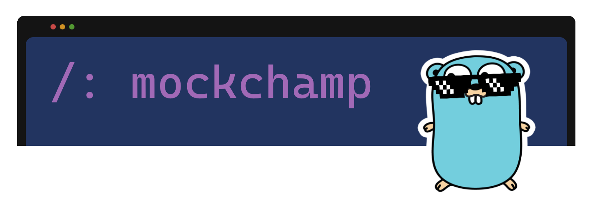

MockChamp - a tool for mock Http Api. This is a regular [docker container](https://hub.docker.com/r/sergeyhartmann/mockchamp)
you can add to your environment.

## Getting Started

```
docker run -d -p 8181:8181 -p 8182:8182 sergeyhartmann/mockchamp
```

MockChamp has two main components:
1) Main server with web interface `http://localhost:8181/ui`. Stores all mock rules for Stub server.
   Using the web interface, you can create, modify and view the current mock rules.
2) Stub server `http://localhost:8182`. Handles incoming Http requests, picks up mock rules
   and makes fake responses.

You can initialize MockChamp when starting a docker container with a set of mock rules from a json file.
To do this, mount `rules.json` (see `Dockerfiles/rules.json`) in the `/mockchamp` folder of your docker container.

```
docker run -d -p 8181:8181 -p 8182:8182 -v $(pwd)/dockerfiles:/mockchamp sergeyhartmann/mockchamp
```

## Environment Variables

```
docker run -d \
  -p 8181:8181 \
  -p 8182:8182 \
  -e PROXY_HOST='google.com' \
  sergeyhartmann/mockchamp
```

`PROXY_HOST`

If the Stub server does not match the mock rule for the request, the request will be proxied to the specified host.
If host is not specified, then the Stub server will return a Response with HTTP Status 200 OK.

`RESPONSE_MESSAGE`

If the Stub server does not match the mock rule for the request, then response body will contain this value.

`RESPONSE_STATUS_CODE`

If the Stub server does not match the mock rule for the request, it will return a response with the specified HTTP status.

## Development

1. Clone repository

```
git clone https://github.com/sergeyhartmann/mockchamp
cd mockchamp
```

2. Get dependencies for Go and run `main.go` (main and stub http servers)

```
go get ./...
go run cmd/mockchamp/main.go
```

3. For web interface run React App

```
cd ui
yarn install
yarn start
```
